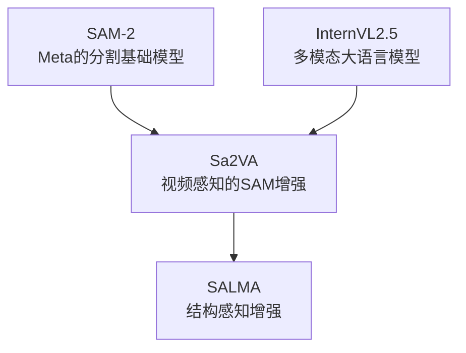
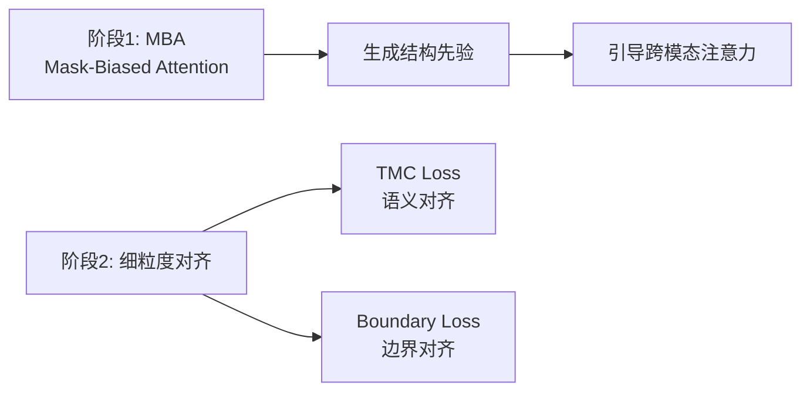

# SALMA 项目深度解析文档

> **SALMA** (Structure-Aware Language-Mask Alignment) - 面向指代分割的结构感知语言-掩码对齐框架

---

## 目录

1. [项目概述](#1-项目概述)
2. [核心问题与动机](#2-核心问题与动机)
3. [技术架构详解](#3-技术架构详解)
4. [核心模块深度剖析](#4-核心模块深度剖析)
5. [训练流程与配置](#5-训练流程与配置)
6. [数据集处理](#6-数据集处理)
7. [推理与部署](#7-推理与部署)
8. [实验结果与分析](#8-实验结果与分析)
9. [面试常见问题](#9-面试常见问题)

---

## 1. 项目概述

### 1.1 项目定位

SALMA 是一个**统一的多模态大语言模型 (MLLM) 框架**，专门解决**指代分割 (Referring Segmentation)** 任务中的"语义-结构鸿沟"问题。

**指代分割任务定义**：给定一张图像/视频和一段自然语言描述，模型需要精确分割出描述所指的目标对象。

```
输入: 图像 + "the person wearing a red shirt on the left"
输出: 对应人物的像素级分割掩码
```

### 1.2 项目继承关系



SALMA 基于 **Sa2VA** 框架构建，核心创新在于引入了**结构感知机制**来解决注意力漂移问题。

### 1.3 关键性能指标

| 基准数据集 | 指标 | Sa2VA-1B (基线) | SALMA (本项目) |
|:---|:---|:---|:---|
| **Ref-DAVIS17** | J&F | 68.5 | **71.9 (+3.4)** |
| **Ref-YouTube-VOS** | J&F | 65.3 | **67.0 (+1.7)** |
| **RefCOCOg (Val)** | cIoU | 77.8 | **78.0** |
| **RefCOCOg (Test)** | cIoU | 77.5 | **78.4** |
| **MeVis** | J&F | 41.7 | **46.0** |

---

## 2. 核心问题与动机

### 2.1 Attention Drift (注意力漂移) 问题

**问题本质**：统一的 MLLM 在处理指代分割时，容易受到图像中**显著干扰物 (salient distractors)** 的影响，导致注意力从真正的目标对象"漂移"到其他视觉突出的区域。

```
场景: 图像中有一个穿红衣的人(目标)和一只大狗(干扰物)
查询: "segment the person in red"
问题: 模型可能错误地关注大狗，因为狗在视觉上更突出
```

**根本原因**：
1. MLLM 的跨模态注意力缺乏显式的**空间约束**
2. 语言特征和视觉特征的对齐是**隐式的**，没有结构引导
3. 预训练的视觉编码器倾向于关注显著区域而非语义相关区域

### 2.2 SALMA 的解决思路

SALMA 提出了**两阶段解决方案**：



**核心思想**：利用 SAM-2 解码器的**类无关结构先验**作为"聚光灯"，引导 MLLM 的注意力聚焦在正确的空间区域。

---

## 3. 技术架构详解

### 3.1 整体架构图

```
┌─────────────────────────────────────────────────────────────────────┐
│                         SALMA 整体架构                               │
├─────────────────────────────────────────────────────────────────────┤
│                                                                      │
│  ┌──────────────┐    ┌──────────────┐    ┌──────────────────────┐  │
│  │   图像/视频   │───▶│  InternVL2.5 │───▶│   语言特征提取        │  │
│  │   输入        │    │  视觉编码器   │    │   (Hidden States)    │  │
│  └──────────────┘    └──────────────┘    └─────────┬────────────┘  │
│                                                      │               │
│  ┌──────────────┐    ┌──────────────┐               │               │
│  │   文本查询    │───▶│  InternVL2.5 │───▶──────────┘               │
│  │              │    │  LLM (LoRA)  │                               │
│  └──────────────┘    └──────────────┘                               │
│                             │                                        │
│                             ▼                                        │
│                    ┌────────────────┐                               │
│                    │  [SEG] Token   │  ← 分割触发标记               │
│                    │  Hidden State  │                               │
│                    └───────┬────────┘                               │
│                            │                                        │
│         ┌──────────────────┼──────────────────┐                    │
│         ▼                  ▼                  ▼                    │
│  ┌─────────────┐   ┌─────────────┐   ┌─────────────────┐          │
│  │ text_hidden │   │ SAM-2 图像  │   │  MBA 模块        │          │
│  │    _fcs     │   │  编码器     │   │ (CrossModal-     │          │
│  │  (投影层)   │   │             │   │  Attention2D)   │          │
│  └──────┬──────┘   └──────┬──────┘   └────────┬────────┘          │
│         │                 │                    │                    │
│         │    ┌────────────┴────────────┐      │                    │
│         │    │     结构先验生成         │◀─────┘                    │
│         │    │  (Visual-only Pre-pass) │                           │
│         │    └────────────┬────────────┘                           │
│         │                 │                                        │
│         │                 ▼                                        │
│         │    ┌────────────────────────┐                           │
│         └───▶│   SAM-2 Mask Decoder   │                           │
│              │   (语言条件解码)        │                           │
│              └────────────┬───────────┘                           │
│                           │                                        │
│                           ▼                                        │
│              ┌────────────────────────┐                           │
│              │     输出分割掩码        │                           │
│              └────────────────────────┘                           │
│                                                                    │
└────────────────────────────────────────────────────────────────────┘
```

### 3.2 核心组件说明

| 组件 | 文件位置 | 功能描述 |
|:---|:---|:---|
| **VideoLLaVASAMModel** | `models/llava_sam2.py` | 主模型类，整合所有组件 |
| **InternVL_Slowfast** | `models/internvl.py` | 多模态语言模型，处理文本和图像 |
| **SAM2TrainRunner** | `models/sam2_train.py` | SAM-2 集成和 CMA 注入 |
| **CrossModalAttention2D** | `models/cma.py` | 跨模态注意力核心模块 |
| **SAM2Base (Extension)** | `models/extension/sam2_base.py` | SAM-2 扩展，支持语言嵌入 |

---

## 4. 核心模块深度剖析

### 4.1 Mask-Biased Attention (MBA) 模块

**文件**: `projects/salma/models/cma.py`

MBA 是 SALMA 的核心创新，通过**结构先验门控**来引导跨模态注意力。

#### 4.1.1 模块初始化参数

```python
class CrossModalAttention2D(nn.Module):
    def __init__(
        self,
        dim: int,                      # 特征维度 (256 for SAM-2)
        num_heads: int = 8,            # 注意力头数
        dropout: float = 0.0,          # Dropout 率
        use_multi_token: bool = False, # 是否使用多 token 路由
        topk_tokens: int = 0,          # Top-K token 选择
        use_film: bool = False,        # 是否使用 FiLM 分支
        enable_mask_bias: bool = False,# 是否启用掩码偏置
        mask_bias_mode: str = "gate",  # 偏置模式: 'gate' 或 'bias'
        mask_bias_tau: float = 1.0,    # 温度参数
        mask_bias_strength: float = 1.0,# 门控强度
    ):
```

#### 4.1.2 前向传播流程

```python
def forward(self, visual, text, mask_logits=None):
    # 1. 准备视觉 Query (B, HW, C)
    x = visual.flatten(2).transpose(1, 2)
    q = layer_norm(x).transpose(0, 1)  # (HW, B, C)
    
    # 2. 准备文本 Key/Value (支持多 token 路由)
    t = self._select_text_tokens(text)  # (B, Nt, C)
    k = v = t.transpose(0, 1)  # (Nt, B, C)
    
    # 3. 计算跨模态注意力
    attn_out = self.attn(q, k, v)  # (B, HW, C)
    
    # 4. 应用掩码门控 (核心创新)
    if mask_logits is not None and self.mask_bias_mode == "gate":
        gate = sigmoid(mask_logits / tau)  # 将掩码转为软门控
        attn_out = attn_out * gate.flatten(1).unsqueeze(-1)
    
    # 5. 门控残差连接
    gamma = self.gamma_attn * self._gamma_scale  # 可学习门控 + 预热缩放
    out = x + gamma * attn_out
    
    return out.reshape(B, C, H, W)
```

#### 4.1.3 关键设计决策

**为什么使用门控 (Gate) 而不是加性偏置 (Bias)?**

```python
# Gate 模式 (采用)
gate = sigmoid(mask_logits / tau)
attn_out = attn_out * gate  # 乘法: 抑制背景，保留前景

# Bias 模式 (备选)
bias = logit(mask_sigmoid)  # 转为 logit 空间
attn_weights += bias        # 加法: 修改注意力分布
```

- **Gate 模式优势**: 更稳定，直接在输出空间操作，不干扰注意力计算
- **Bias 模式问题**: 可能导致梯度不稳定，训练初期容易发散

**Top-K Token 路由机制**：

```python
def _select_text_tokens(self, text):
    if self.topk_tokens > 0:
        # 使用可学习的路由 MLP 计算每个 token 的重要性分数
        scores = self.token_gate(text)  # (B, N)
        topk_idx = scores.topk(k=self.topk_tokens).indices
        picked = torch.gather(text, dim=1, index=topk_idx)
        return picked
    return text
```

这确保只有最相关的 K 个语言 token 参与跨模态注意力，降低计算开销并提高聚焦能力。

### 4.2 SAM-2 集成与语言嵌入注入

**文件**: `projects/salma/models/sam2_train.py`

#### 4.2.1 结构先验生成 (Visual-Only Pre-pass)

```python
def inject_language_embd(self, sam_states, language_embd, ...):
    # 1. 获取图像特征
    pix_feat_with_mem = prepare_features(sam_states)
    pre_cma_feat = pix_feat_with_mem  # 保存 CMA 前的特征 (用于 TMC Loss)
    
    # 2. 生成结构先验 (关键步骤)
    if self.mask_source == "pred":
        # 不使用语言的"纯视觉"解码，获得类无关的分割先验
        low_res_masks_pre = self.sam2_model._forward_sam_heads(
            backbone_features=pre_cma_feat,
            language_embd=None,  # 关键: 不注入语言
            ...
        )
        mask_logits_for_cma = low_res_masks_pre.detach()  # 停止梯度
    
    # 3. 应用跨模态注意力 (使用结构先验门控)
    pix_feat_with_mem = self.cma(
        pix_feat_with_mem, 
        lang_feats, 
        mask_logits=mask_logits_for_cma  # 结构先验作为门控信号
    )
    
    # 4. 最终解码 (使用语言嵌入)
    pred_masks = self.sam2_model._forward_sam_heads(
        backbone_features=pix_feat_with_mem,
        language_embd=language_embeddings,  # 注入语言
        ...
    )
    return pred_masks
```

#### 4.2.2 SAM-2 扩展 - 语言嵌入拼接

**文件**: `projects/salma/models/extension/sam2_base.py`

```python
def _forward_sam_heads(self, backbone_features, language_embd=None, ...):
    # 标准 SAM-2 prompt encoding
    sparse_embeddings, dense_embeddings = self.sam_prompt_encoder(
        points=(sam_point_coords, sam_point_labels),
        masks=sam_mask_prompt,
    )
    
    # SALMA 扩展: 将语言嵌入拼接到 sparse embeddings
    if language_embd is not None:
        sparse_embeddings = torch.cat(
            [sparse_embeddings, language_embd], 
            dim=1  # 在 token 维度拼接
        )
    
    # 解码
    masks = self.sam_mask_decoder(
        image_embeddings=backbone_features,
        sparse_prompt_embeddings=sparse_embeddings,
        ...
    )
```

### 4.3 辅助损失函数

**文件**: `projects/salma/utils/losses.py`

#### 4.3.1 Text-Mask Contrastive (TMC) Loss

**目的**: 确保 [SEG] token 的语义表示与对应掩码区域的视觉特征对齐。

```python
def tmc_loss(visual: Tensor, text: Tensor, temperature: float = 0.07):
    """
    Args:
        visual: (N, D) - 掩码区域的池化视觉特征
        text:   (N, D) - [SEG] token 的嵌入
    """
    # L2 归一化
    v = F.normalize(visual.float(), dim=-1)
    t = F.normalize(text.float(), dim=-1)
    
    # 计算相似度矩阵
    logits = (v @ t.t()) / temperature  # (N, N)
    
    # 对称 InfoNCE 损失
    labels = torch.arange(N)  # 对角线为正样本
    loss_i = F.cross_entropy(logits, labels)      # visual → text
    loss_t = F.cross_entropy(logits.t(), labels)  # text → visual
    
    return 0.5 * (loss_i + loss_t)
```

**视觉特征提取**:

```python
def masked_avg_pool(feat: Tensor, mask: Tensor):
    """在掩码区域内平均池化特征"""
    mask = mask.to(feat.dtype)
    num = (feat * mask).sum(dim=(2, 3))  # 掩码加权求和
    den = mask.sum(dim=(2, 3)).clamp_min(1e-6)  # 掩码面积
    return num / den  # (N, C)
```

#### 4.3.2 Boundary Consistency Loss

**目的**: 确保预测掩码的边界与真实掩码的边界对齐。

```python
def boundary_loss(pred_logits: Tensor, gt_masks: Tensor):
    """使用 Sobel 算子提取边缘"""
    pred_prob = pred_logits.sigmoid()
    
    # Sobel 边缘检测
    edges_pred = sobel(pred_prob)  # 预测边缘
    edges_gt = sobel(gt_masks)     # 真实边缘
    
    # L1 距离
    loss = F.l1_loss(edges_pred, edges_gt)
    return loss

class _Sobel(nn.Module):
    def __init__(self):
        # 3x3 Sobel 核
        kx = [[1, 0, -1], [2, 0, -2], [1, 0, -1]]
        ky = [[1, 2, 1], [0, 0, 0], [-1, -2, -1]]
        
    def forward(self, x):
        gx = F.conv2d(x, self.kx, padding=1)
        gy = F.conv2d(x, self.ky, padding=1)
        return torch.sqrt(gx**2 + gy**2 + 1e-6)
```

### 4.4 预热机制 (Warmup Hooks)

#### 4.4.1 CMA 预热

**文件**: `projects/salma/utils/cma_warmup_hook.py`

```python
class CMAWarmupHook(Hook):
    """
    逐渐增加 CMA 残差强度，避免训练初期过度条件化。
    """
    def after_train_iter(self, runner, ...):
        warmup_iters = max_iters * self.warmup_ratio
        cur_iter = runner.iter + 1
        scale = min(1.0, cur_iter / warmup_iters)  # 从 0 到 1 线性增长
        
        for mod in self._cma_modules:
            mod.set_cma_warmup_scale(scale)
```

**为什么需要 CMA 预热?**

- 训练初期，CMA 模块的参数是随机初始化的
- 如果一开始就让 CMA 有完全的影响力，可能导致收敛困难
- 通过预热，让模型先学习基础的语言-视觉对齐，再逐步引入结构先验

#### 4.4.2 辅助损失预热

**文件**: `projects/salma/utils/aux_warmup_hook.py`

```python
class AuxLossWarmupHook(Hook):
    """
    逐渐增加 TMC/Boundary Loss 的权重。
    """
    def after_train_iter(self, runner, ...):
        scale = min(1.0, cur_iter / warmup_iters)
        for mod in self._targets:
            mod.set_aux_loss_warmup_scale(scale)
```

---

## 5. 训练流程与配置

### 5.1 训练配置详解

**文件**: `projects/salma/configs/SALMA-1B.py`

#### 5.1.1 模型配置

```python
model = dict(
    type=VideoLLaVASAMModel_zero3,
    special_tokens=["[SEG]", "<p>", "</p>", "<vp>", "</vp>"],
    frozen_sam2_decoder=False,  # 解冻 SAM-2 解码器
    
    # MLLM 配置
    mllm=dict(
        type=InternVL_Slowfast,
        model_path="InternVL2_5-1B",
        freeze_llm=True,           # 冻结 LLM
        freeze_visual_encoder=True, # 冻结视觉编码器
        llm_lora=dict(             # 使用 LoRA 微调
            type=LoraConfig,
            r=128,                  # LoRA rank
            lora_alpha=256,
            lora_dropout=0.05,
        ),
    ),
    
    # SAM-2 + CMA 配置
    grounding_encoder=dict(
        type=SAM2TrainRunner,
        enable_cma=True,           # 启用跨模态注意力
        cma_num_heads=8,
        cma_use_multi_token=True,  # 多 token 路由
        cma_topk_tokens=2,         # Top-2 选择
        cma_use_film=False,        # 禁用 FiLM (实验3)
        enable_mask_bias=True,     # 启用掩码偏置
        mask_bias_mode="gate",     # 门控模式
        mask_source="pred",        # 使用预测掩码作为先验
    ),
    
    # 损失函数
    loss_mask=dict(type=CrossEntropyLoss, loss_weight=2.0),
    loss_dice=dict(type=DiceLoss, loss_weight=0.5),
    loss_tmc_weight=0.1,           # TMC 损失权重
    loss_boundary_weight=0.05,     # 边界损失权重
    tmc_temperature=0.15,          # 对比学习温度
    aux_loss_warmup_ratio=0.2,     # 辅助损失预热比例
)
```

#### 5.1.2 训练超参数

```python
# 批次大小与累积
batch_size = 2              # 每 GPU
accumulative_counts = 4     # 梯度累积步数
# 有效批次大小 = 2 * 4 * 8 GPUs = 64

# 优化器
lr = 4e-5
weight_decay = 0.05
max_norm = 1.0              # 梯度裁剪

# 学习率调度
warmup_ratio = 0.05         # 5% 预热
# LinearLR → CosineAnnealingLR

max_epochs = 1              # 单 epoch 训练
```

#### 5.1.3 可训练参数统计

| 组件 | 状态 | 参数量估计 |
|:---|:---|:---|
| InternVL2.5 视觉编码器 | 冻结 | 0 |
| InternVL2.5 LLM | LoRA | ~10M |
| SAM-2 图像编码器 | 冻结 | 0 |
| SAM-2 Mask 解码器 | 可训练 | ~4M |
| CMA 模块 | 可训练 | ~1M |
| text_hidden_fcs | 可训练 | ~2M |
| **总可训练参数** | | **~17M** |

### 5.2 数据集混合策略

```python
train_dataset = dict(
    type=ConcatDataset,
    datasets=[
        # 图像指代分割 (重复4次以平衡)
        refcoco_segm_dataset,       # × 4
        refcoco_plus_segm_dataset,  # × 4
        refcocog_segm_dataset,      # × 4
        
        # 视频指代分割
        video_mevis_dataset,        # repeats=4
        video_revos_dataset,        # repeats=10
        video_refytvos_dataset,     # repeats=4
        
        # 视频问答
        video_qa_dataset,           # repeats=1
        
        # SAM-2 伪标签数据
        video_sam2_dataset,         # repeats=4
        
        # GCG (Grounded Caption Generation)
        glamm_psg_dataset,
        glamm_grandf_dataset,       # repeats=10
        glamm_flickr_dataset,
        glamm_refcocog_dataset,
        
        # 图像问答
        llava_vqa_dataset,
        
        # 视觉 Prompt 对话
        image_osprey_dataset,
        image_osprey_description_dataset,
        ...
    ],
)
```

---

## 6. 数据集处理

### 6.1 视频指代分割数据集

**文件**: `projects/salma/datasets/ReVOS_Dataset.py`

#### 6.1.1 数据加载流程

```python
class VideoReVOSDataset(Dataset):
    def __getitem__(self, index):
        # 1. 获取视频的所有对象信息
        video_objects_infos = [self.text_data[idx] for idx in selected_objects]
        
        # 2. 随机采样 K 帧 (默认 5 帧)
        selected_frame_indexes = np.random.choice(len_frames, select_k)
        
        # 3. 加载图像帧
        for frame_path in frames_files:
            frame_image = Image.open(frame_path)
            # 标准化处理
            pixel_values.append(self.transformer(frame_image))
            # SAM-2 预处理
            g_pixel_values.append(self.extra_image_processor(frame_image))
        
        # 4. 构建对话文本
        text_dict = self.prepare_text(n_frames, expressions)
        
        # 5. 解码掩码
        masks = self.decode_mask(video_masks, image_size)
        
        # 6. 应用模板映射
        result = self.template_map_fn(data_dict)
        
        # 7. Tokenize
        result = video_lisa_encode_fn(data_dict, tokenizer, max_length)
        
        return data_dict
```

#### 6.1.2 对话模板构建

```python
SEG_QUESTIONS = [
    "Can you segment the {class_name} in this image?",
    "Please segment {class_name} in this image.",
    "What is {class_name} in this image? Please respond with segmentation mask.",
    ...
]

ANSWER_LIST = [
    "It is [SEG].",
    "Sure, [SEG].",
    "Sure, the segmentation result is [SEG].",
    ...
]

def prepare_text(self, n_frames, expressions):
    # 构建多帧图像 token
    frame_token_str = f"{IMG_CONTEXT_TOKEN * 256}</img>"
    frame_tokens = (frame_token_str + "\n") * n_frames
    
    qa_list = []
    for i, exp in enumerate(expressions):
        question = SEG_QUESTIONS[random.choice(...)]
        answer = ANSWER_LIST[random.choice(...)]
        
        if i == 0:
            qa_list.append({"from": "human", "value": frame_tokens + question})
        else:
            qa_list.append({"from": "human", "value": question})
        qa_list.append({"from": "gpt", "value": answer})
    
    return {"conversation": qa_list}
```

#### 6.1.3 掩码解码

```python
def decode_mask(self, video_masks, image_size):
    """
    video_masks: List[List[RLE_mask]] 
                 [n_objects, n_frames, RLE_encoded_mask]
    """
    ret_masks = []
    for object_masks in video_masks:
        _object_masks = []
        for i_frame in range(n_frames):
            _mask = np.zeros(image_size, dtype=np.uint8)
            for anno_mask in object_masks:
                if anno_mask[i_frame] is not None:
                    m = maskUtils.decode(anno_mask[i_frame])
                    _mask = _mask | m  # 合并多个标注
            _object_masks.append(_mask)
        ret_masks.append(np.stack(_object_masks))
    
    # (n_obj, n_frames, H, W) → (n_obj * n_frames, H, W)
    return torch.from_numpy(np.stack(ret_masks)).flatten(0, 1)
```

---

## 7. 推理与部署

### 7.1 Gradio Demo

**文件**: `projects/salma/gradio/app_unified.py`

#### 7.1.1 模型加载

```python
def load_model(model_path: str, dtype: str, device: str):
    from projects.salma.hf.models.modeling_sa2va_chat import Sa2VAChatModel
    
    model = Sa2VAChatModel.from_pretrained(
        model_path,
        torch_dtype=TORCH_DTYPE_MAP[dtype],
        device_map=device,
    )
    tokenizer = model.get_tokenizer()
    return model, tokenizer
```

#### 7.1.2 推理流程

```python
def infer_handler(media_file, user_text, state, chatbot):
    # 1. 判断任务类型
    is_segmentation = "[SEG]" in user_text or "segment" in user_text.lower()
    
    # 2. 构建输入
    if is_video:
        video_frames = preprocess_video(media_file)
        input_dict = build_input_dict("video_seg", None, video_frames, user_text)
    else:
        image = Image.open(media_file)
        input_dict = build_input_dict("image_seg", image, None, user_text)
    
    # 3. 模型推理
    with torch.no_grad():
        output = sa2va_model.predict_video(
            pixel_values=input_dict["pixel_values"],
            text_prompts=input_dict["text"],
        )
    
    # 4. 后处理掩码
    if output["masks"] is not None:
        result_image = overlay_masks(base_image, output["masks"])
    
    return result_image, output["text"], chatbot
```

### 7.2 HuggingFace 模型转换

**文件**: `projects/salma/hf/convert_to_hf.py`

将训练好的 checkpoint 转换为 HuggingFace 格式，便于分享和部署。

```bash
python projects/salma/hf/convert_to_hf.py \
    --checkpoint_path work_dirs/SALMA-1B/epoch_1.pth \
    --output_path SALMA-1B-HF
```

---

## 8. 实验结果与分析

### 8.1 消融实验

| 配置 | Ref-DAVIS17 J&F | RefCOCOg cIoU |
|:---|:---|:---|
| 基线 (Sa2VA-1B) | 68.5 | 77.8 |
| + CMA (无 MBA) | 69.2 | 77.6 |
| + MBA (Gate) | 70.8 | 77.9 |
| + Top-K Routing (K=2) | 71.3 | 77.8 |
| + TMC Loss | 71.6 | 77.9 |
| + Boundary Loss | **71.9** | **78.0** |

### 8.2 计算开销分析

| 组件 | GFLOPs | 延迟增加 |
|:---|:---|:---|
| Visual Pre-pass | 0.8 | +5ms |
| CMA Module | 0.1 | +2ms |
| **总额外开销** | **< 1** | **+7ms (~0.7%)** |

### 8.3 注意力可视化

SALMA 的 MBA 机制可以有效抑制对干扰物的注意力，将焦点集中在目标对象上：

```
原始注意力 (Sa2VA):     MBA 引导后 (SALMA):
┌───────────────┐       ┌───────────────┐
│ ▓▓▓▓    ░░░░  │       │ ▓▓▓▓    ░░░░  │
│ ▓▓▓▓    ░░░░  │  →    │ ████    ░░░░  │
│ ▓▓▓▓    ████  │       │ ████    ░░░░  │
│       (分散)   │       │    (聚焦)      │
└───────────────┘       └───────────────┘
▓ = 高注意力, ░ = 低注意力, █ = 目标对象
```

---

## 9. 面试常见问题

### Q1: SALMA 解决了什么问题？

**答**: SALMA 解决了统一 MLLM 在指代分割任务中的**注意力漂移 (Attention Drift)** 问题。当图像中存在视觉显著的干扰物时，模型容易错误地关注这些干扰物而非真正的目标对象。SALMA 通过引入**结构感知机制**，利用 SAM-2 的类无关分割先验作为空间约束，引导跨模态注意力聚焦在正确区域。

### Q2: MBA 模块的核心原理是什么？

**答**: MBA (Mask-Biased Attention) 的核心是**利用结构先验进行注意力门控**：

1. **Pre-pass**: 首先让 SAM-2 在不使用语言的情况下生成一个"纯视觉"的分割先验
2. **Gate**: 将这个先验转换为软门控信号 `G = sigmoid(mask_logits / τ)`
3. **Modulation**: 用门控信号调制跨模态注意力的输出 `out = attn_out * G`

这样，背景区域的特征会被抑制，前景区域的特征会被保留，从而引导后续解码聚焦在正确位置。

### Q3: 为什么选择 Gate 模式而不是 Bias 模式？

**答**: 
- **Gate 模式**：在注意力输出空间操作，更稳定，梯度路径简单
- **Bias 模式**：在注意力权重空间操作，需要修改 softmax 分布，可能导致数值不稳定

实验表明 Gate 模式在训练稳定性和最终性能上都更优。

### Q4: TMC Loss 的作用是什么？

**答**: TMC (Text-Mask Contrastive) Loss 确保**语义对齐**：

- 正样本：[SEG] token 嵌入 ↔ 对应掩码区域的视觉特征
- 负样本：同一 batch 内其他样本的掩码区域

这个对比损失确保模型生成的 [SEG] token 真正"理解"了对应的视觉区域，而不仅仅是生成正确的文本。

### Q5: 项目中有哪些工程挑战？

**答**:
1. **梯度不稳定**: CMA 模块初期随机初始化可能导致梯度爆炸，通过 warmup hook 解决
2. **多任务平衡**: 混合数据集训练需要精心设计 repeat 策略
3. **显存优化**: 视频帧数多时显存压力大，使用 gradient checkpointing 和 DeepSpeed ZeRO-2
4. **推理效率**: Pre-pass 增加了额外计算，但通过优化控制在 < 1% 延迟增加

### Q6: 如何进一步改进 SALMA？

**答**:
1. **时序 MBA**: 在视频帧之间传播掩码先验，利用时序一致性
2. **多尺度 MBA**: 在高分辨率特征图上也应用 CMA (目前仅在低分辨率)
3. **自适应门控强度**: 根据目标大小自动调整门控强度
4. **更强的基座模型**: 升级到 InternVL2.5-4B 或更大模型

---

## 附录 A: 代码导航

| 功能 | 文件路径 |
|:---|:---|
| 主模型定义 | `projects/salma/models/llava_sam2.py` |
| CMA 模块 | `projects/salma/models/cma.py` |
| SAM-2 集成 | `projects/salma/models/sam2_train.py` |
| InternVL 封装 | `projects/salma/models/internvl.py` |
| SAM-2 扩展 | `projects/salma/models/extension/sam2_base.py` |
| 损失函数 | `projects/salma/utils/losses.py` |
| 训练配置 | `projects/salma/configs/SALMA-1B.py` |
| 视频数据集 | `projects/salma/datasets/ReVOS_Dataset.py` |
| Gradio Demo | `projects/salma/gradio/app_unified.py` |
| HF 模型导出 | `projects/salma/hf/convert_to_hf.py` |

---

## 附录 B: 术语表

| 术语 | 全称 | 含义 |
|:---|:---|:---|
| MLLM | Multimodal Large Language Model | 多模态大语言模型 |
| MBA | Mask-Biased Attention | 掩码偏置注意力 |
| CMA | Cross-Modal Attention | 跨模态注意力 |
| TMC | Text-Mask Contrastive | 文本-掩码对比 |
| RES | Referring Expression Segmentation | 指代表达分割 |
| RVOS | Referring Video Object Segmentation | 指代视频目标分割 |
| SAM | Segment Anything Model | 分割一切模型 |
| LoRA | Low-Rank Adaptation | 低秩适配 |
| FiLM | Feature-wise Linear Modulation | 特征级线性调制 |

---

*文档生成时间: 2026-02-01*
*项目版本: SALMA v1.0*
